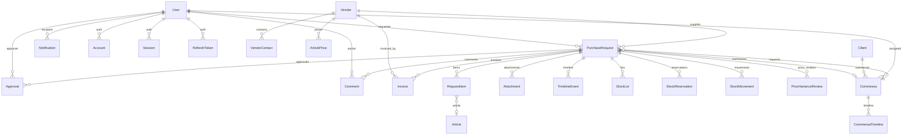
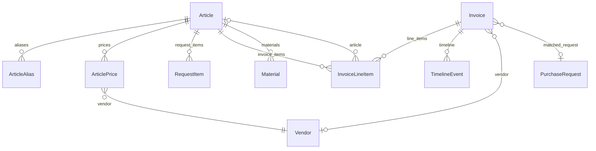
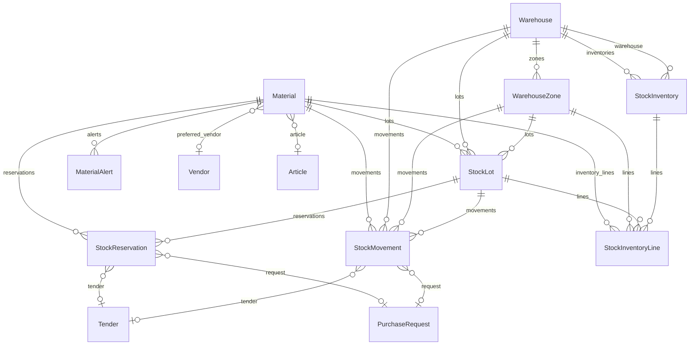
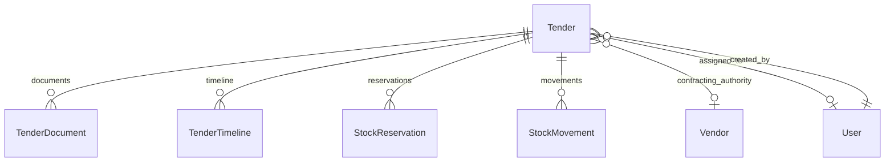
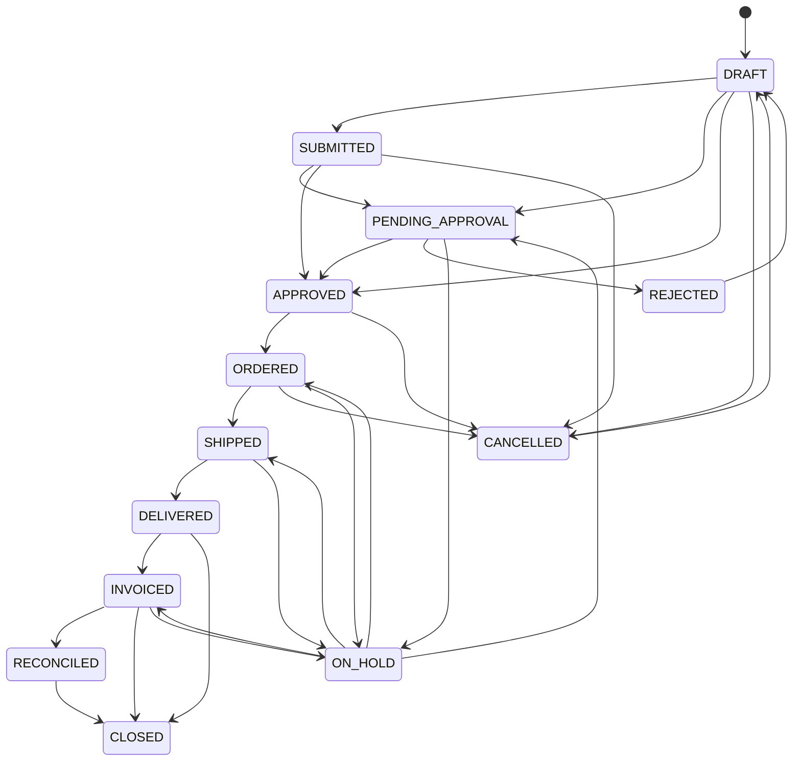
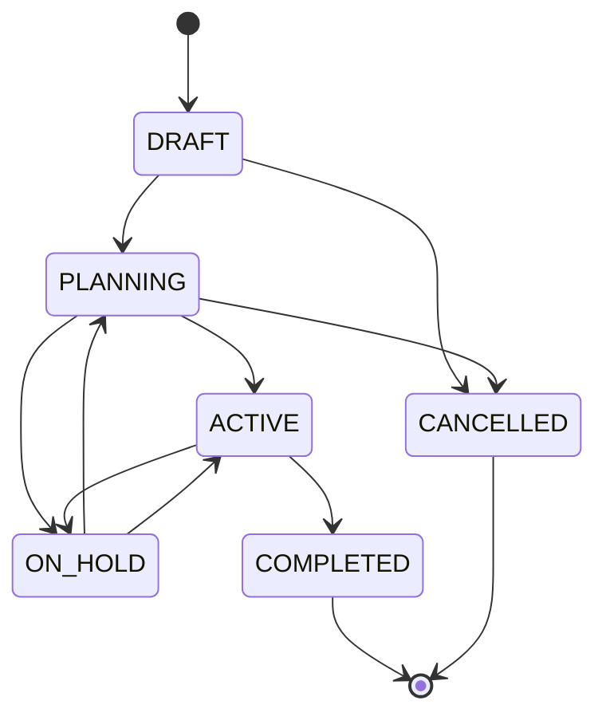
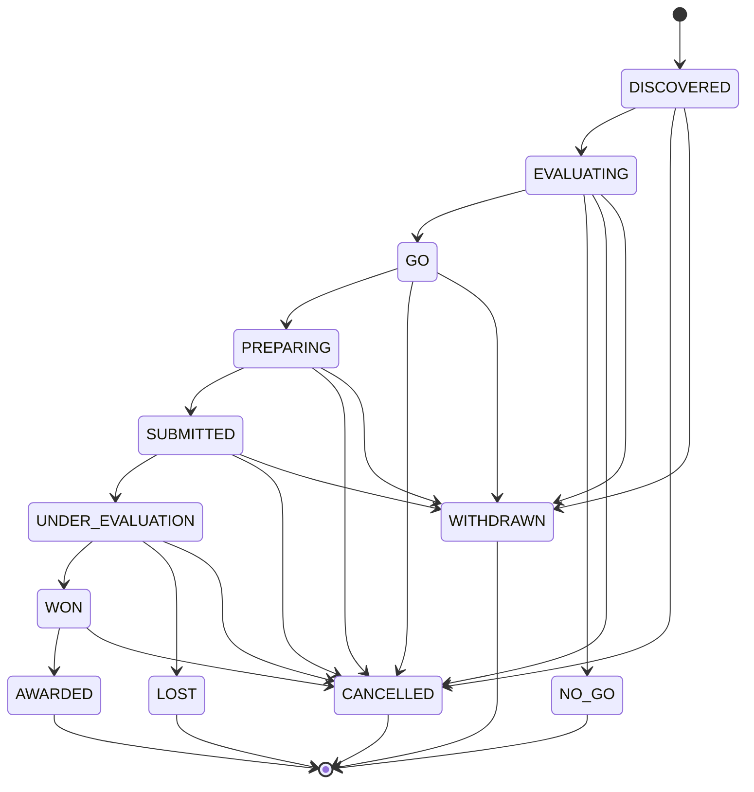

# ProcureFlow — Modello Dati

Generato il: 2026-04-17
Commit di riferimento: 689013a
Schema: `prisma/schema.prisma` (1.353 righe, 42 modelli, 4 migrazioni)

---

## 1. Panoramica

42 modelli Prisma raggruppati in 9 domini:

### Auth (4 modelli)
| Modello | Scopo |
|---|---|
| `Account` | Account OAuth collegato a un utente (NextAuth) |
| `Session` | Sessione attiva di un utente (NextAuth) |
| `VerificationToken` | Token di verifica email (NextAuth) |
| `RefreshToken` | Token di refresh con hash SHA-256 per rotazione sicura |

### Core Procurement (8 modelli)
| Modello | Scopo |
|---|---|
| `User` | Utente del sistema con ruolo, MFA, lockout, onboarding |
| `Vendor` | Fornitore con anagrafica, portale, partita IVA |
| `VendorContact` | Contatto nominativo di un fornitore |
| `PurchaseRequest` | Richiesta d'acquisto — entita centrale del dominio |
| `RequestItem` | Riga articolo di una richiesta con prezzo, IVA, article link |
| `Approval` | Decisione di approvazione/rifiuto su una richiesta |
| `Comment` | Commento su una richiesta (interno o visibile a vendor) |
| `Attachment` | File allegato a una richiesta |

### Timeline & Notifiche (2 modelli)
| Modello | Scopo |
|---|---|
| `TimelineEvent` | Evento di audit su una richiesta o fattura |
| `Notification` | Notifica in-app per un utente |

### Clienti & Commesse (3 modelli)
| Modello | Scopo |
|---|---|
| `Client` | Cliente finale che commissiona un ordine |
| `Commessa` | Ordine cliente che genera richieste d'acquisto |
| `CommessaTimeline` | Evento di audit su una commessa |

### Catalogo Articoli (3 modelli)
| Modello | Scopo |
|---|---|
| `Article` | Articolo del catalogo con codice, unita di misura, verifiche |
| `ArticleAlias` | Alias articolo per vendor/client/standard con dedup |
| `ArticlePrice` | Prezzo storico di un articolo presso un fornitore |

### Fatturazione (2 modelli)
| Modello | Scopo |
|---|---|
| `Invoice` | Fattura elettronica ricevuta via SDI, con matching e riconciliazione |
| `InvoiceLineItem` | Riga di una fattura con matching a RequestItem |

### Budget (2 modelli)
| Modello | Scopo |
|---|---|
| `Budget` | Budget allocato per centro di costo con enforcement mode |
| `BudgetSnapshot` | Snapshot periodico di speso/impegnato/disponibile |

### Gare d'Appalto (3 modelli)
| Modello | Scopo |
|---|---|
| `Tender` | Gara d'appalto con ciclo completo dall'individuazione all'aggiudicazione |
| `TenderDocument` | Documento allegato a una gara (bando, offerta, contratto) |
| `TenderTimeline` | Evento di audit su una gara |

### Inventario (7 modelli)
| Modello | Scopo |
|---|---|
| `Material` | Materiale a magazzino, collegabile a un articolo del catalogo |
| `Warehouse` | Magazzino fisico |
| `WarehouseZone` | Zona di un magazzino |
| `StockLot` | Lotto di materiale in un magazzino con quantita e scadenza |
| `StockReservation` | Prenotazione di stock per una PR o gara |
| `StockMovement` | Movimento di magazzino (entrata, uscita, trasferimento, rettifica) |
| `StockInventory` | Sessione di inventario fisico |
| `StockInventoryLine` | Riga di conteggio in un inventario |

### AI & Integrazioni (5 modelli)
| Modello | Scopo |
|---|---|
| `AiInsight` | Insight generato dall'AI (anomalie spesa, rischi vendor, risparmi) |
| `MaterialAlert` | Alert di stock (sotto scorta, esaurito, riordino suggerito) |
| `ProcessedWebhook` | Idempotency store per webhook (evita duplicati) |
| `EmailLog` | Log di email processate dall'agente AI |
| `PriceVarianceReview` | Revisione di variazione prezzo in attesa di decisione umana |

### Configurazione (2 modelli)
| Modello | Scopo |
|---|---|
| `DeployConfig` | Configurazione tenant: moduli abilitati, categorie, reparti |
| `IntegrationConfig` | Configurazione integrazione esterna (IMAP, SDI, vendor API) — cifrata AES-256-GCM |

---

## 2. Diagrammi ER (Mermaid)

### 2.1 Procurement Core

### 2.2 Catalogo & Fatturazione

### 2.3 Inventario

### 2.4 Gare d'Appalto

---

## 3. Modelli in Dettaglio

Per brevita, sono documentati in dettaglio solo i modelli con status field, relazioni complesse, o rilevanza architetturale. I modelli piu semplici (VendorContact, Comment, Attachment, ecc.) sono descritti in panoramica.

### 3.1 PurchaseRequest

**Entita centrale del dominio.** Ogni acquisto nasce come PR, attraversa un ciclo di approvazione, ordine, consegna, fatturazione, riconciliazione.

| Campo | Tipo | Null | Default | Note |
|---|---|---|---|---|
| id | String | no | cuid() | PK |
| code | String | no | — | Unique, formato `PR-YYYY-NNNNN` |
| title | String | no | — | |
| description | String | si | — | |
| status | RequestStatus | no | DRAFT | 13 stati possibili |
| priority | Priority | no | MEDIUM | LOW/MEDIUM/HIGH/URGENT |
| requester_id | String | no | — | FK → User, onDelete: Restrict |
| vendor_id | String | si | — | FK → Vendor |
| commessa_id | String | si | — | FK → Commessa |
| estimated_amount | Decimal(12,2) | si | — | |
| actual_amount | Decimal(12,2) | si | — | |
| invoiced_amount | Decimal(12,2) | si | — | |
| currency | String | no | "EUR" | |
| needed_by | DateTime | si | — | |
| ordered_at | DateTime | si | — | Settato quando status→ORDERED |
| expected_delivery | DateTime | si | — | |
| delivered_at | DateTime | si | — | Settato quando status→DELIVERED |
| email_message_id | String | si | — | Unique, per dedup email→PR |
| external_ref | String | si | — | Riferimento ordine fornitore |
| external_url | String | si | — | Link portale fornitore |
| tracking_number | String | si | — | |
| cig | String | si | — | Codice Identificativo Gara |
| cup | String | si | — | Codice Unico Progetto |
| is_mepa | Boolean | no | false | |
| mepa_oda_number | String | si | — | |
| is_ai_suggested | Boolean | no | false | |
| category | String | si | — | |
| department | String | si | — | |
| cost_center | String | si | — | |
| budget_code | String | si | — | |
| tags | String[] | no | — | |
| created_at | DateTime | no | now() | |
| updated_at | DateTime | no | @updatedAt | |

**Indici**: `(status, created_at)`, `(requester_id, status)`, `(vendor_id, status)`, `(needed_by)`, `(department, cost_center)`, `(cost_center, status)`, `(commessa_id)`.

**Relazioni uscenti**: items (1:N), approvals (1:N), comments (1:N), attachments (1:N), timeline (1:N), invoices (1:N), stock_lots (1:N), stock_reservations (1:N), stock_movements (1:N), price_variance_reviews (1:N).

### 3.2 Invoice

| Campo | Tipo | Null | Default | Note |
|---|---|---|---|---|
| id | String | no | cuid() | PK |
| sdi_id | String | si | — | Unique, ID dal Sistema di Interscambio |
| invoice_number | String | no | — | |
| invoice_date | DateTime | no | — | |
| total_taxable | Decimal(12,2) | no | — | |
| total_tax | Decimal(12,2) | no | — | |
| total_amount | Decimal(12,2) | no | — | |
| supplier_vat_id | String | no | — | P.IVA fornitore (per auto-matching) |
| supplier_name | String | no | — | |
| customer_vat_id | String | no | — | P.IVA nostro tenant |
| match_status | InvoiceMatchStatus | no | UNMATCHED | 5 stati |
| match_confidence | Float | si | — | |
| match_candidates | Json | si | — | Array di request_id candidati |
| reconciliation_status | ReconciliationStatus | no | PENDING | 6 stati |
| amount_discrepancy | Decimal(12,2) | si | — | |
| discrepancy_type | DiscrepancyType | si | — | |
| vendor_id | String | si | — | FK → Vendor |
| purchase_request_id | String | si | — | FK → PurchaseRequest |
| tenant_id | String | no | "default" | Hard-coded default tenant |
| xml_raw | String (Text) | si | — | XML FatturaPA originale |

**Indici**: `(supplier_vat_id)`, `(pr_code_extracted)`, `(match_status)`, `(reconciliation_status)`, `(tenant_id)`, `(invoice_date)`, `(vendor_id)`, `(purchase_request_id)`.

### 3.3 Tender

53 campi. Il modello piu ampio dello schema. Copre l'intero ciclo di una gara d'appalto.

Campi chiave: `code` (Unique, `GARA-YYYY-NNNNN`), `status` (TenderStatus, 12 stati), `go_no_go` (GoNoGoDecision, 3 valori), `tender_type` (TenderType, 7 valori).

**Indici**: `(status, submission_deadline)`, `(status, created_at)`, `(cig)`, `(contracting_authority_id, status)`, `(assigned_to_id, status)`.

### 3.4 Material

Materiale a magazzino con unita primaria/secondaria, livelli min/max, costo unitario.

Campo `article_id` (nullable FK → Article) collega il materiale al catalogo articoli. Campo `preferred_vendor_id` (nullable FK → Vendor).

**Indici**: `(category, is_active)`, `(code)`, `(barcode)`.

### 3.5 Commessa

Ordine cliente che genera una o piu richieste d'acquisto.

Campi chiave: `code` (Unique, `COM-YYYY-NNNNN`), `status` (CommessaStatus, 6 stati), `client_id` (FK → Client, obbligatorio), `client_value` (Decimal), `deadline`, `email_message_id` (Unique, dedup).

**Indici**: `(status, created_at)`, `(client_id)`, `(deadline)`.

---

## 4. Macchine a Stati

### 4.1 PurchaseRequest — RequestStatus

Definita in `src/lib/state-machine.ts:11-27`.

**13 stati, 28 transizioni.**

Transizioni chiave nel codice:
- DRAFT → SUBMITTED/PENDING_APPROVAL/APPROVED: `src/app/api/requests/[id]/submit/route.ts:51-121` (auto-approvazione per MANAGER/ADMIN)
- PENDING_APPROVAL → APPROVED/REJECTED: `src/app/api/webhooks/approval-response/route.ts:123-138` e `src/server/agents/tools/procurement.tools.ts:1021-1053`
- APPROVED → ORDERED: `src/server/agents/tools/procurement.tools.ts:1282` e `src/app/api/requests/[id]/route.ts:195`
- ORDERED → DELIVERED: `src/server/agents/tools/procurement.tools.ts:1314` e `src/app/api/requests/[id]/route.ts:196`
- DELIVERED → INVOICED: `src/app/api/invoices/[id]/match/route.ts:82` e `src/app/api/webhooks/sdi-invoice/route.ts:284`
- INVOICED → RECONCILED: `src/app/api/invoices/[id]/reconcile/route.ts:73`
- * → CANCELLED: `src/server/agents/tools/procurement.tools.ts:1132`
- * → ON_HOLD: `src/server/agents/tools/procurement.tools.ts:1211`
- ON_HOLD → (precedente): `src/server/agents/tools/procurement.tools.ts:1254`
- CANCELLED → DRAFT: `src/lib/state-machine.ts:25` (riabilitazione)

**Nota**: CLOSED e uno stato terminale senza transizioni in uscita. Non esiste nel codice un punto esplicito che setti status=CLOSED; la transizione e permessa dalla state machine ma non implementata in nessuna route o tool.

### 4.2 Commessa — CommessaStatus

Definita in `src/lib/commessa-state-machine.ts:3-12`.

**6 stati, 9 transizioni.** Applicata via `assertCommessaTransition()` in `src/server/services/commessa.service.ts:182`.

Transizioni nel codice:
- DRAFT → PLANNING: `src/server/agents/tools/commessa.tools.ts:170` (alla creazione via agent, status iniziale PLANNING)
- * → new_status: `src/app/api/commesse/[code]/route.ts:70` via `updateCommessaStatus()`

### 4.3 Tender — TenderStatus

Definita in `src/lib/constants/tenders.ts:123-136`.

**12 stati, 22 transizioni. 5 stati terminali** (NO_GO, LOST, AWARDED, CANCELLED, WITHDRAWN).

Transizioni nel codice:
- DISCOVERED → EVALUATING/etc.: `src/app/api/tenders/[id]/status/route.ts:39` (via `$transaction`)
- EVALUATING → GO/NO_GO: `src/app/api/tenders/[id]/go-no-go/route.ts:32-42` (richiede stato EVALUATING)
- Delete solo se DISCOVERED: `src/app/api/tenders/[id]/route.ts:174`

### 4.4 Invoice — match_status (InvoiceMatchStatus)

Nessuna state machine formale nel codice. Transizioni implicite:
- UNMATCHED → AUTO_MATCHED/SUGGESTED: durante upload/SDI import (`src/app/api/invoices/upload/route.ts`, `src/app/api/webhooks/sdi-invoice/route.ts`)
- UNMATCHED/SUGGESTED → MANUALLY_MATCHED: `src/app/api/invoices/[id]/match/route.ts`
- * → UNMATCHED: `src/app/api/invoices/[id]/unmatch/route.ts`

### 4.5 Invoice — reconciliation_status (ReconciliationStatus)

Nessuna state machine formale. 6 valori: PENDING, MATCHED, APPROVED, DISPUTED, REJECTED, PAID.
- PENDING → APPROVED: `src/app/api/invoices/[id]/reconcile/route.ts:59`
- PENDING → REJECTED: `src/app/api/invoices/[id]/reconcile/route.ts:134`

### 4.6 Approval — ApprovalStatus

4 valori: PENDING, APPROVED, REJECTED, DELEGATED.
- PENDING → APPROVED/REJECTED: `src/app/api/approvals/[id]/decide/route.ts` e `src/app/api/webhooks/approval-response/route.ts`

**Nota**: DELEGATED e dichiarato nell'enum ma non esiste nessun codice che setti questo stato. Stato irraggiungibile.

### 4.7 StockInventory — StockInventoryStatus

4 valori: DRAFT, IN_PROGRESS, COMPLETED, CANCELLED.
- DRAFT → IN_PROGRESS/COMPLETED: `src/app/api/inventory/inventories/[id]/route.ts:189`

### 4.8 PriceVarianceReview — PriceVarianceStatus

4 valori: PENDING, ACCEPTED, REJECTED, NEGOTIATING.
- PENDING → ACCEPTED/REJECTED/NEGOTIATING: `src/app/api/price-variance/[id]/route.ts:60`

---

## 5. Relazioni Implicite e FK Soft

### FK morali non modellate come relazione Prisma

| Modello | Campo | Punta a | Note |
|---|---|---|---|
| `Invoice` | `tenant_id` | (nessun modello Tenant) | Default "default". Nessun modello Tenant. Preparazione per multi-tenancy mai implementata. |
| `Invoice` | `matched_by` | `User.id` | Chi ha fatto il match manuale. String, non FK. |
| `Invoice` | `reconciled_by` | `User.id` | Chi ha riconciliato. String, non FK. |
| `InvoiceLineItem` | `matched_item_id` | `RequestItem.id` | Match riga fattura → riga ordine. String, non FK. |
| `StockMovement` | `to_warehouse_id` | `Warehouse.id` | Destinazione per trasferimenti. String, non FK. |
| `StockMovement` | `to_zone_id` | `WarehouseZone.id` | Zona destinazione. String, non FK. |
| `StockMovement` | `actor` | `User.id` | Chi ha eseguito il movimento. String, non FK. |
| `StockMovement` | `inventory_line_id` | `StockInventoryLine.id` | String, non FK. |
| `StockInventory` | `created_by` | `User.id` | String, non FK. |
| `StockInventory` | `completed_by` | `User.id` | String, non FK. |
| `StockReservation` | `reserved_by` | `User.id` | String, non FK. |
| `Budget` | `created_by` | `User.id` | String, non FK. |
| `Tender` | `go_no_go_decided_by` | `User.id` | String, non FK. |
| `TenderDocument` | `uploaded_by` | `User.id` | String, non FK. |
| `TimelineEvent` | `actor` | `User.id` o nome | Stringa libera, non FK. Contiene sia ID utente sia "Sistema" sia "AI Agent". |
| `CommessaTimeline` | `actor` | `User.id` o nome | Stesso pattern. |
| `EmailLog` | `request_id` | `PurchaseRequest.id` | String, non FK. |
| `EmailLog` | `commessa_id` | `Commessa.id` | String, non FK. |
| `EmailLog` | `invoice_id` | `Invoice.id` | String, non FK. |
| `EmailLog` | `processed_by_user_id` | `User.id` | String, non FK. |
| `PriceVarianceReview` | `email_log_id` | `EmailLog.id` | String, non FK. |
| `PriceVarianceReview` | `decided_by` | `User.id` | String, non FK. |
| `ArticleAlias` | `entity_id` | `Vendor.id` o `Client.id` | FK polimorfica. Null per alias STANDARD. |

**Pattern generale**: Tutti i campi `*_by` (actor, decided_by, created_by, etc.) sono stringhe libere, non FK. Questo significa che non c'e integrita referenziale se un utente viene eliminato — i riferimenti diventano ID orfani.

### JSON fields che contengono ID

| Modello | Campo | Contenuto |
|---|---|---|
| `Invoice` | `match_candidates` | Array di `request_id` (PurchaseRequest.id) |
| `PriceVarianceReview` | `items` | Array di `{item_name, old_price, new_price, delta_pct, quantity}` — nessun ID |
| `DeployConfig` | `approval_rules` | JSON con regole di approvazione — struttura non tipata |
| `DeployConfig` | `article_config` | JSON `{ auto_match_threshold: 0 }` |
| `TimelineEvent` | `metadata` | JSON generico — contiene spesso `budgetId`, `from`/`to` status |

---

## 6. Analisi Indici e Performance

### Indici dichiarati per modello

| Modello | Indici espliciti | Unique | FK con indice auto |
|---|---|---|---|
| Account | 0 | `(provider, providerAccountId)` | userId (auto) |
| Session | 0 | `sessionToken` | userId (auto) |
| RefreshToken | `(user_id, revoked)`, `(expires_at)` | `token_hash` | user_id (coperto) |
| User | 0 | `email` | — |
| Vendor | `(status)` | `code`, `vat_id` | — |
| PurchaseRequest | 7 indici composti | `code`, `email_message_id` | requester_id, vendor_id (coperti) |
| Article | `(name)`, `(category)`, `(manufacturer_code)`, `(is_active)`, `(verified)` | `code` | — |
| ArticleAlias | `(alias_code)`, `(article_id)`, `(entity_id)` | `(alias_type, alias_code, entity_id)` | article_id (coperto) |
| ArticlePrice | `(article_id, vendor_id)`, `(vendor_id)` | — | article_id, vendor_id (coperti) |
| Approval | `(request_id, status)`, `(approver_id, status)` | — | request_id, approver_id (coperti) |
| TimelineEvent | `(request_id, created_at)`, `(email_message_id)`, `(invoice_id)` | — | request_id, invoice_id (coperti) |
| Notification | `(user_id, read)` | — | user_id (coperto) |
| Client | `(status)`, `(name)` | `code` | — |
| Commessa | `(status, created_at)`, `(client_id)`, `(deadline)` | `code`, `email_message_id` | client_id (coperto) |
| Invoice | 8 indici | `sdi_id` | vendor_id, purchase_request_id (coperti) |
| Budget | `(cost_center, period_start, period_end)`, `(is_active, cost_center)` | — | — |
| Tender | 5 indici | `code`, `cig` (non unique) | contracting_authority_id, assigned_to_id (coperti) |
| Material | `(category, is_active)`, `(code)`, `(barcode)` | `code` | preferred_vendor_id (no idx), article_id (no idx) |
| StockLot | `(material_id, status)`, `(warehouse_id, zone_id)`, `(lot_number)`, `(purchase_request_id)` | `lot_number` | material_id, warehouse_id (coperti) |
| StockMovement | 5 indici | `code` | material_id (coperto) |
| StockReservation | `(material_id, status)`, `(tender_id)`, `(purchase_request_id)` | — | material_id (coperto) |
| StockInventory | `(warehouse_id, status)` | `code` | warehouse_id (coperto) |

### Query ricorrenti e indici mancanti

| Query pattern | File | Indice presente? |
|---|---|---|
| `purchaseRequest.findMany({ where: { status: { notIn: [...] } } })` | `dashboard.service.ts:51` | Si: `(status, created_at)` |
| `purchaseRequest.findMany({ where: { commessa_id } })` | Vari | Si: `(commessa_id)` |
| `invoice.findMany({ where: { supplier_vat_id } })` | `sdi-invoice/route.ts` | Si: `(supplier_vat_id)` |
| `material.findUnique({ where: { article_id } })` | `article.tools.ts` | **No** — `article_id` su Material non ha indice |
| `material.findMany({ where: { preferred_vendor_id } })` | `stock.tools.ts` | **No** — `preferred_vendor_id` non ha indice |
| `notification.findMany({ where: { user_id, read: false }, orderBy: { created_at: 'desc' } })` | `notifications/route.ts` | `(user_id, read)` ma manca `created_at` nella composizione |
| `stockLot.findMany({ where: { material_id, status: 'AVAILABLE' } })` | `inventory-db.service.ts` | Si: `(material_id, status)` |

**Candidati a indice mancante**:
1. `Material.article_id` — usato in lookup articolo→materiale
2. `Material.preferred_vendor_id` — usato in lookup vendor→materiali preferiti
3. `Tender.cig` — dichiarato come indice non-unique, ma dovrebbe essere unique nel dominio reale

---

## 7. Transazioni e Consistenza

### Usi di `prisma.$transaction`

30 usi totali nel codice. Divisi in:
- **Batch read** (parallel queries): 8 usi per `[findMany, count]` parallelizzati
- **Transazione interattiva** (closure con `tx`): 10 usi per operazioni multi-step
- **Batch write** (array di operazioni): 12 usi per update + timeline create atomici

### Operazioni multi-step coperte da transaction

| Operazione | File | Tipo |
|---|---|---|
| Creazione commessa + code generation | `commessa.tools.ts:113` | Interactive tx |
| Update status commessa + timeline | `commessa.service.ts:172` | Interactive tx |
| Update status PR + timeline + notification | `procurement.tools.ts:1041-1320` | Batch array tx |
| Creazione articolo + code generation | `articles/route.ts:107` | Interactive tx |
| Creazione cliente + code generation | `clients/route.ts:101` | Interactive tx |
| Creazione vendor + code generation | `vendors/quick/route.ts:18` | Interactive tx |
| Completamento inventario + adjustment movements | `inventory/inventories/[id]/route.ts:189` | Interactive tx |
| Go/No-Go tender + timeline | `tenders/[id]/go-no-go/route.ts:42` | Batch array tx |
| Update tender status + timeline | `tenders/[id]/status/route.ts:39` | Batch array tx |
| Price variance decide + timeline + notification | `price-variance/[id]/route.ts:60` | Batch array tx |

### Operazioni multi-step SENZA transaction

| Operazione | File | Rischio |
|---|---|---|
| Submit PR → budget check → approval workflow → timeline | `requests/[id]/submit/route.ts:27-129` | Medio: se `initiateApprovalWorkflow` fallisce dopo il budget check, lo stato PR potrebbe essere inconsistente. Il budget snapshot refresh e non-bloccante (catch ignorato). |
| Invoice upload → parse XML → create Invoice + items → auto-match → update PR status | `invoices/upload/route.ts` | Alto: 320 righe di logica, crea Invoice, InvoiceLineItem, TimelineEvent, e aggiorna PurchaseRequest.status in sequenza. Un errore a meta lascia dati parziali. |
| SDI webhook → parse → create → match → timeline | `webhooks/sdi-invoice/route.ts` | Alto: 431 righe, stessa problematica dell'upload. |
| Email agent → multiple write tool calls | `email-intelligence.agent.ts` | Medio: ogni tool call e una transazione isolata. Se l'agent crea 3 PR ma fallisce alla 4a, le prime 3 restano. Mitigato dal blast radius limit (PF-002). |

### Race condition sulla generazione codici

La funzione `generateNextCodeAtomic()` in `src/server/services/code-generator.service.ts` usa `SELECT ... FOR UPDATE` per serializzare la generazione. Questo e corretto e previene collisioni sotto carico concorrente.

Per i codici inventario (LOT, MOV, INV), la generazione in `src/server/services/inventory.service.ts:8-42` usa un semplice contatore sequenziale SENZA `FOR UPDATE`. Queste funzioni (`generateMaterialCode`, `generateMovementCode`, etc.) accettano un numero di sequenza dall'esterno e non fanno query DB — il rischio di collisione dipende da chi chiama.

### Idempotency

Webhook idempotency implementata via `ProcessedWebhook` model in:
- `src/app/api/webhooks/sdi-invoice/route.ts:56`
- `src/app/api/webhooks/vendor-update/route.ts:66`
- `src/app/api/webhooks/email-ingestion/classify/route.ts:77`

Pattern: controlla se `webhook_id` esiste in `processed_webhooks`, se si ritorna il risultato cached.

**Non idempotente**: `/api/webhooks/email-ingestion/route.ts` e `/api/webhooks/approval-response/route.ts` — non usano il ProcessedWebhook store. Una chiamata duplicata crea dati duplicati.

Dedup email: `PurchaseRequest.email_message_id` (unique) e `Commessa.email_message_id` (unique) prevengono la creazione di PR/commesse duplicate dalla stessa email. `EmailLog.email_message_id` (unique) previene log duplicati.

---

## 8. Tipi Sensibili (Money, Date, PII, Secrets)

### Money

Tutti i campi monetari usano `Decimal(12,2)` — corretto per EUR. Nessun `Float` per importi.

| Modello | Campi Decimal(12,2) |
|---|---|
| PurchaseRequest | estimated_amount, actual_amount, invoiced_amount |
| RequestItem | unit_price, total_price |
| Invoice | total_taxable, total_tax, total_amount, amount_discrepancy |
| Tender | base_amount, our_offer_amount, awarded_amount, winner_amount |
| Commessa | client_value |
| Budget | allocated_amount |
| BudgetSnapshot | spent, committed, available |
| ArticlePrice | unit_price |
| PriceVarianceReview | total_old_amount, total_new_amount, total_delta |
| EmailLog | extracted_amount, extracted_old_price, extracted_new_price |

Eccezioni con precisione diversa:
- `InvoiceLineItem.quantity` e `unit_price`: `Decimal(12,4)` — 4 decimali per quantita frazionarie
- `Material.unit_cost`, `StockLot.unit_cost`, `StockMovement.unit_cost`: `Decimal(12,4)`
- `RequestItem.vat_rate`, `InvoiceLineItem.vat_rate`: `Decimal(5,2)`
- `Material.conversion_factor`: `Decimal(12,6)` — fattore di conversione unita
- Quantita stock: `Decimal(12,3)` — 3 decimali

**Nota**: `Invoice.match_confidence`, `EmailLog.confidence`, `PriceVarianceReview.max_delta_percent`, `EmailLog.price_delta_percent` e `MaterialAlert.days_remaining` usano `Float`. Questi non sono importi ma percentuali/score, quindi accettabile.

### Date

Tutti i campi data usano `DateTime` Prisma (mappato a `TIMESTAMP(3)` PostgreSQL, UTC).

Nessuna gestione timezone esplicita nel codice. Le date sono memorizzate in UTC e formattate nel frontend con `formatDate()` (utility in `src/lib/utils.ts`).

`EmailLog.email_date` e `String` (non DateTime) — contiene la data come appare nell'header email, potenzialmente in qualsiasi formato.

### PII (Dati Personali)

| Modello | Campo | Tipo PII | Cifrato? | Indicizzato? |
|---|---|---|---|---|
| User | email | Email | No | Si (unique) |
| User | name | Nome | No | No |
| User | password_hash | Credential | Hashed (bcrypt) | No |
| User | totp_secret | Credential | Si (AES-256-GCM, PF-001) | No |
| User | recovery_codes | Credential | Hashed (bcrypt array) | No |
| Vendor | email | Email | No | No |
| Vendor | phone | Telefono | No | No |
| Vendor | vat_id | P.IVA | No | Si (unique) |
| VendorContact | email, phone | Email, Tel | No | No |
| Client | email, phone, tax_id, address | Multipli | No | No |
| Invoice | supplier_vat_id | P.IVA | No | Si (index) |
| Invoice | customer_vat_id | P.IVA | No | No |
| Invoice | iban | Bancario | No | No |
| EmailLog | email_from, email_to, email_body | Email, contenuto | No | No |

**Nota**: IBAN e in chiaro. Le P.IVA sono indicizzate per il matching fatture — corretto per il dominio, ma sono dati fiscali. Nessun campo PII e cifrato a parte le credenziali di autenticazione.

### Secrets

| Modello | Campo | Protezione |
|---|---|---|
| User | password_hash | bcrypt hash |
| User | totp_secret | AES-256-GCM (PF-001) |
| User | recovery_codes | bcrypt hash array |
| RefreshToken | token_hash | SHA-256 hash (PF-004) |
| IntegrationConfig | config | AES-256-GCM |
| Account | refresh_token, access_token, id_token | In chiaro (NextAuth standard) |

`Account.refresh_token/access_token/id_token` (OAuth tokens da NextAuth) sono in chiaro nel DB. Questo e il comportamento default di NextAuth.

---

## 9. Codici di Dominio

### Formati

| Entita | Formato | Esempio |
|---|---|---|
| PurchaseRequest | `PR-YYYY-NNNNN` | PR-2026-00001 |
| Commessa | `COM-YYYY-NNNNN` | COM-2026-00001 |
| Client | `CLI-YYYY-NNNNN` | CLI-2026-00001 |
| Article | `ART-YYYY-NNNNN` | ART-2026-00001 |
| Vendor | `VND-YYYY-NNNNN` | VND-2026-00001 |
| Material | `MAT-YYYY-NNNNN` | MAT-2026-00001 |
| Tender | `GARA-YYYY-NNNNN` | GARA-2026-00001 |
| StockMovement | `MOV-YYYY-NNNNN` | MOV-2026-00001 |
| StockLot | `LOT-YYYY-NNNNN` | LOT-2026-00001 |
| StockInventory | `INV-YYYY-NNNNN` | INV-2026-00001 |

### Generazione

La funzione atomica `generateNextCodeAtomic()` in `src/server/services/code-generator.service.ts` gestisce PR, COM, CLI, ART, MAT, VND.

Meccanismo:
1. `SELECT code FROM "{table}" WHERE code LIKE '{PREFIX}-{YEAR}-%' ORDER BY code DESC LIMIT 1 FOR UPDATE`
2. Estrai l'ultimo numero, incrementa di 1
3. Ritorna `{PREFIX}-{YEAR}-{padded_number}`

**Atomicita**: `FOR UPDATE` serializza le letture concorrenti. Se chiamata dentro una transazione esterna, usa quella; altrimenti crea la propria con timeout 5s.

**Tabelle ammesse**: hardcoded in `ALLOWED_TABLES` — sql injection safe.

I codici inventario (MOV, LOT, INV) sono generati da funzioni diverse in `src/server/services/inventory.service.ts:8-42` che accettano un `sequenceNumber` esterno — il chiamante deve garantire l'unicita.

### Rollover annuale

Il codice include l'anno (`YYYY`). Al cambio anno, il contatore riparte da 00001 automaticamente perche la query `LIKE 'PR-2027-%'` non trovera codici e partira da 1.

### Ricomputabilita

I codici non sono ricomputabili — sono generati sequenzialmente e salvati nel DB. Se un codice viene eliminato, il gap non viene recuperato.

---

## 10. Migration History

### Totale: 4 migrazioni

| # | Data | Nome | Cosa fa |
|---|---|---|---|
| 1 | 2026-03-10 | `init` | Schema iniziale completo: 290 righe SQL. Crea tutti i modelli core, inventory, invoicing, tenders, budgets, AI insights. Nessun dato migrato. |
| 2 | 2026-03-30 | `add_departments_costcenters_integrations` | Aggiunge `departments[]` e `cost_centers[]` a `deploy_config`. Crea tabella `integration_configs`. Additive, nessun rischio. |
| 3 | 2026-04-03 | `article_master` | Crea modulo articoli: `articles`, `article_aliases`, `article_prices`. Aggiunge `article_id` a `request_items`, `invoice_line_items`, `materials`. Aggiunge `article_config` a `deploy_config`. Aggiunge estensione `pg_trgm`. Additive. |
| 4 | 2026-04-17 | `pf004_hash_refresh_tokens` | **BREAKING**: `TRUNCATE refresh_tokens` + `RENAME COLUMN token → token_hash`. Invalida tutte le sessioni. Data destruction intenzionale (documention nel file SQL). Idempotente (TRUNCATE + RENAME sono safe da rieseguire). |

### Analisi rischi

- Nessuna migrazione fa DROP COLUMN (tranne il RENAME semantico in #4).
- Nessuna migrazione fa UPDATE su righe esistenti (data migration). Il TRUNCATE in #4 e una scelta esplicita (eliminare token in chiaro).
- La migrazione #4 e l'unica distruttiva e ha rollback documentato nel commento SQL.
- **Nota**: lo schema corrente ha 42 modelli ma solo 4 migrazioni. Questo significa che Prisma `db push` e stato usato pesantemente per applicare cambiamenti durante lo sviluppo. I modelli aggiunti dopo la migrazione #3 (EmailLog, PriceVarianceReview, e numerose colonne su modelli esistenti come `verified` su Article, `email_message_id` su PurchaseRequest/Commessa, ecc.) non hanno migrazioni corrispondenti — sono stati applicati via `db push` senza generare file di migrazione.

---

## 11. Note per il Futuro

1. **Lo schema usa `db push` come meccanismo principale di evoluzione.** 42 modelli con solo 4 migrazioni formali. In produzione, questo significa che non c'e un record affidabile di come lo schema e evoluto dopo il 3 aprile 2026. Qualsiasi diff tra lo schema Prisma e il DB reale non e tracciato.

2. **23 campi `*_by` sono stringhe libere, non FK.** Se un utente viene eliminato, i riferimenti nei timeline events, movimenti, inventari, budget, e fatture diventano ID orfani senza cascata. Il pattern e consistente (tutto il progetto lo fa cosi) ma non c'e integrita referenziale.

3. **`Invoice.tenant_id` con default "default"** prepara per multi-tenancy ma nessun altro modello ha un campo tenant. Se multi-tenancy viene implementata, richiede aggiunta su tutti i modelli, non solo Invoice.

4. **I codici inventario (MOV, LOT, INV) usano un generatore diverso** da quello atomico `FOR UPDATE` usato per PR, COM, CLI, ART, MAT, VND. Il generatore inventario accetta un `sequenceNumber` esterno senza serializzazione — sotto carico concorrente, il chiamante deve gestire la concorrenza.

5. **Stato CLOSED su PurchaseRequest e definito nella state machine ma non e mai scritto da nessuna route o tool.** Le PR restano in DELIVERED, INVOICED, o RECONCILED indefinitamente. Analogamente, `ApprovalStatus.DELEGATED` e dichiarato ma irraggiungibile.

6. **`InvoiceLineItem.matched_item_id` e una FK soft** (String, non relazione Prisma) verso `RequestItem.id`. Il three-way matching opera su questa relazione ma senza integrita referenziale — se un RequestItem viene eliminato (CASCADE da PurchaseRequest), il `matched_item_id` diventa un riferimento pendente.

7. **La colonna `Invoice.xml_raw`** memorizza l'intero XML FatturaPA come testo. Per fatture da centinaia di righe, questo campo puo pesare diversi KB per riga. Non c'e indicizzazione full-text su questo campo. Se la tabella invoices cresce a migliaia di righe, i backup e le query `SELECT *` includeranno tutto l'XML.

8. **`EmailLog.email_body`** memorizza l'intero corpo email come testo. Stesso pattern di Invoice.xml_raw. Potenzialmente KB per riga, senza limite di dimensione dichiarato nello schema.

9. **Nessun soft delete in nessun modello.** Tutte le cancellazioni sono hard delete. `PurchaseRequest.onDelete: Cascade` elimina items, comments, attachments, timeline. `User.onDelete: Restrict` su Approval impedisce di eliminare un utente che ha approvato qualcosa — corretto, ma `User.onDelete: Cascade` su Account/Session/RefreshToken/Notification elimina tutta la storia di auth.

10. **Il campo `ArticleAlias.entity_id`** e una FK polimorfica (puo puntare a Vendor.id o Client.id a seconda di `alias_type`). Questo pattern non e esprimibile come relazione Prisma e non ha integrita referenziale.
